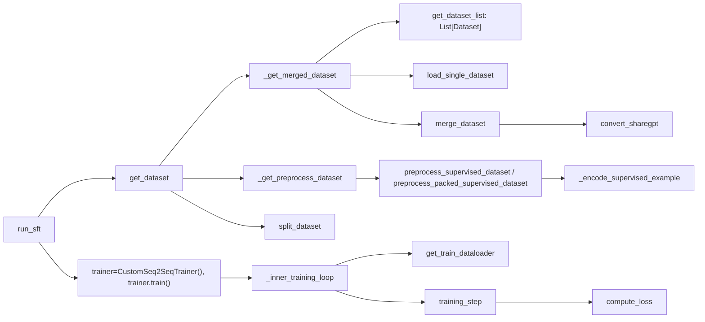

```mermaid
graph LR
O[run_sft] --> X[get_dataset]
O --> Y["trainer=CustomSeq2SeqTrainer(), trainer.train()"]

X --> A[_get_merged_dataset]
X --> B[_get_preprocess_dataset]
X --> C[split_dataset]

A --> D["get_dataset_list: List[Dataset]"]
A --> E["load_single_dataset"]
A --> F[merge_dataset]
F --> G[convert_sharegpt]

B --> H[preprocess_supervised_dataset / preprocess_packed_supervised_dataset]
H --> I[_encode_supervised_example]

Y --> J[_inner_training_loop]
J --> K[get_train_dataloader]
J --> L[training_step]
L --> M[compute_loss]
```
